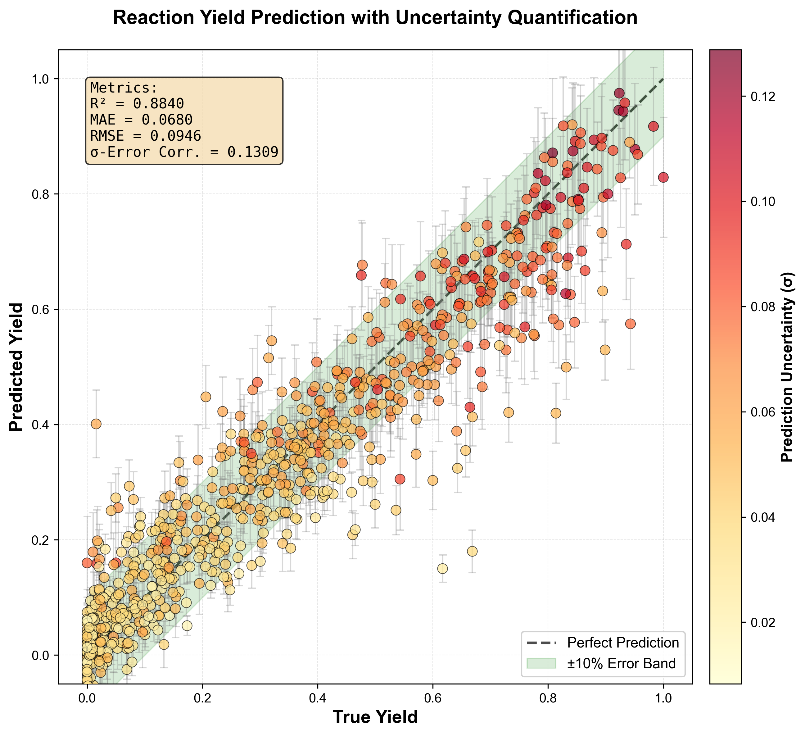

# Quick Start Guide - YieldUQ-GNN

## 🚀 5-Minute Setup

### Prerequisites
- Python 3.13+
- pip or conda

### Installation

```bash
# Clone repository
git clone https://github.com/Yuvraj-cyborg/YieldUQ.git
cd YieldUQ-GNN

# Install dependencies
pip install -e .

# Verify installation
python -c "import torch; import torch_geometric; from rdkit import Chem; print('✅ All dependencies installed!')"
```

---

## 📊 Run Your First Prediction

### 1. Prepare Your Data

Create `data/Dreher_and_Doyle_input_data.xlsx` with these columns:

| Ligand | Additive | Base | Aryl halide | Output |
|--------|----------|------|-------------|--------|
| P(tBu)3 | None | DBU | 4-bromobenzonitrile | 0.85 |
| XPhos | NaI | Cs2CO3 | bromobenzene | 0.72 |
| ... | ... | ... | ... | ... |

**Requirements**:
- `Output`: Reaction yield (0-1 or 0-100, will be normalized)
- Other columns: Categorical names (strings)
- At least 100 samples recommended

---

### 2. Train the Model

```bash
python main.py
```

**What happens**:
1. ✅ Loads and preprocesses data (2-5 seconds)
2. ✅ Trains GNN for 20 epochs (~1-2 minutes)
3. ✅ Runs uncertainty estimation (~30 seconds)
4. ✅ Generates 6 visualization plots in `plots/`
5. ✅ Saves summary statistics

---

### 3. Check Results

**Terminal output**:
```
Epoch 20/20 | Loss: 0.0234 | R²: 0.8765
Running Monte Carlo Dropout for Uncertainty Estimation...
Uncertainty-Error Correlation: 0.1234

📊 Generating Comprehensive Visualization Report
[1/6] Creating uncertainty visualization...
...
✅ Report complete! All plots saved to: plots/
```

**Generated files**:
- `plots/yield_uncertainty.png` - Main prediction plot
- `plots/error_distribution.png` - Uncertainty vs error
- `plots/calibration.png` - Reliability diagram
- `plots/mc_distributions.png` - MC dropout distributions
- `plots/residuals.png` - Residual analysis
- `plots/summary_stats.txt` - Performance metrics

---

## 📖 Understanding Your Results

### 1. Yield Uncertainty Plot



**What to look for**:
- ✅ Points near diagonal = good predictions
- ✅ Larger error bars on outliers = model knows uncertainty
- ❌ Points far from diagonal with small bars = overconfident wrong predictions

**Metrics box**:
- **R² > 0.80**: Good model
- **MAE < 0.10**: Low average error
- **σ-Error Corr > 0.15**: Uncertainty is informative

---

### 2. Error Distribution Plot

**Interpretation**:
- Upward trend = uncertainty correlates with error (GOOD ✅)
- No trend = uncertainty is not useful (needs improvement ❌)
- Correlation > 0.2 = reasonably calibrated

---

### 3. Calibration Plot

**Perfect calibration**: Points on diagonal
- Above diagonal = underconfident (predicting too much uncertainty)
- Below diagonal = overconfident (predicting too little uncertainty)

**ECE (Expected Calibration Error)**:
- < 0.05: Well calibrated ✅
- 0.05-0.10: Acceptable
- > 0.10: Needs calibration improvement

---

## 🔧 Customization

### Adjust Hyperparameters

Edit `main.py`:

```python
# Model architecture
model = GNNModel(
    in_channels=6,           # Atom features
    hidden_channels=128,     # ⬆️ Increase for larger model
    category_sizes=category_sizes,
    embed_dim=32             # ⬆️ Increase for richer embeddings
)

# Training
n_epochs = 50                # ⬆️ More epochs
lr = 5e-4                    # ⬇️ Lower learning rate
batch_size = 32              # ⬇️ Smaller for stable gradients

# Uncertainty
n_mc_samples = 50            # ⬆️ More samples = smoother uncertainty
```

---

### Use Your Own Dataset

**Option A**: Replace Excel file
```python
dataset = ReactionDataset("data/my_reactions.xlsx")
```

**Option B**: CSV file
Modify `src/dataset.py`:
```python
import pandas as pd
df = pd.read_csv("data/reactions.csv")
```

**Required columns**:
- Categorical features (any names)
- `Output` or `Yield` for target

---

### Save and Load Models

Add to `main.py`:

```python
# After training
torch.save({
    'model_state_dict': model.state_dict(),
    'category_maps': dataset.category_maps,
    'r2_score': r2
}, 'trained_model.pt')

# Later: Load model
checkpoint = torch.load('trained_model.pt')
model.load_state_dict(checkpoint['model_state_dict'])
category_maps = checkpoint['category_maps']
```

---

## 🎯 Making New Predictions

```python
from src.model import GNNModel
from src.graph_builder import mol_to_graph
import torch

# Load trained model
model = GNNModel(...)
model.load_state_dict(torch.load('trained_model.pt')['model_state_dict'])
model.eval()

# New reaction
smiles = "c1ccccc1.Br"  # Benzene + Br
ligand_id = category_maps['Ligand']['P(tBu)3']
base_id = category_maps['Base']['DBU']
additive_id = category_maps['Additive']['None']
aryl_id = category_maps['Aryl halide']['bromobenzene']

# Build graph
data = mol_to_graph(smiles, y=None)
data.ligand_idx = torch.tensor([ligand_id])
data.additive_idx = torch.tensor([additive_id])
data.base_idx = torch.tensor([base_id])
data.aryl_idx = torch.tensor([aryl_id])
data.batch = torch.zeros(data.x.shape[0], dtype=torch.long)

# MC Dropout prediction
preds = []
for _ in range(50):
    with torch.no_grad():
        pred = model(data.x, data.edge_index, data.batch,
                    data.ligand_idx, data.additive_idx, 
                    data.base_idx, data.aryl_idx)
    preds.append(pred.item())

mean_yield = np.mean(preds)
uncertainty = np.std(preds)

print(f"Predicted Yield: {mean_yield:.3f} ± {uncertainty:.3f}")
```

---

## 🐛 Troubleshooting

### Error: "No module named 'torch_geometric'"
```bash
pip install torch-geometric
```

### Error: "RDKit not found"
```bash
pip install rdkit
# or for conda:
conda install -c conda-forge rdkit
```

### Error: "CUDA out of memory"
Reduce batch size:
```python
train_loader = DataLoader(train_dataset, batch_size=16)  # was 64
```

### Low R² Score (< 0.70)
- ✅ Check data quality (any NaN values?)
- ✅ Increase epochs to 50-100
- ✅ Try larger model: `hidden_channels=128`
- ✅ Add more training data

### High Uncertainty Everywhere
- ✅ Reduce dropout: `Dropout(0.1)` instead of 0.2
- ✅ Train longer
- ✅ Check if model is learning (loss decreasing?)

### Poor Calibration (points off diagonal)
- ✅ Increase MC samples to 100
- ✅ Tune dropout rate (try 0.15 or 0.25)
- ✅ Implement heteroscedastic uncertainty (see IMPROVEMENTS.md)

---

## 📚 Next Steps

1. **Read the full README** for detailed architecture explanation
2. **Check IMPROVEMENTS.md** for enhancement ideas
3. **Experiment with hyperparameters** to beat baseline
4. **Add edge features** (bonds) for +5-10% R² improvement
5. **Try heteroscedastic uncertainty** for better calibration

---

## 💡 Tips & Best Practices

### Data Preparation
- ✅ Clean SMILES strings (remove salts: `Chem.SaltRemover`)
- ✅ Standardize molecules (canonical SMILES)
- ✅ Check for duplicates
- ✅ Validate all reactions can be parsed by RDKit

### Training
- ✅ Monitor both train and validation loss
- ✅ Use early stopping (stop when val loss plateaus)
- ✅ Try different random seeds (5 runs, report mean±std)

### Evaluation
- ✅ Always use held-out test set (never seen during training)
- ✅ Check residual plots for bias
- ✅ Report multiple metrics (R², MAE, RMSE)
- ✅ Visualize worst predictions to find patterns

### Uncertainty
- ✅ Higher MC samples = more stable uncertainty (but slower)
- ✅ Check calibration plot - this tells if σ is meaningful
- ✅ Use uncertainty for active learning (label high-σ samples)

---

## 📞 Getting Help

- **Issues**: [GitHub Issues](https://github.com/Yuvraj-cyborg/YieldUQ/issues)
- **Discussions**: [GitHub Discussions](https://github.com/Yuvraj-cyborg/YieldUQ/discussions)
- **Email**: [Create issue on GitHub]

---

## 🎓 Learn More

### Tutorials
1. [PyTorch Geometric Tutorial](https://pytorch-geometric.readthedocs.io/en/latest/notes/introduction.html)
2. [RDKit Getting Started](https://www.rdkit.org/docs/GettingStartedInPython.html)
3. [Uncertainty in Deep Learning (Blog)](https://www.inference.vc/uncertainty-in-deep-learning/)

### Example Notebooks
Coming soon: `examples/` folder with Jupyter notebooks

---

**Happy Predicting! 🚀**
