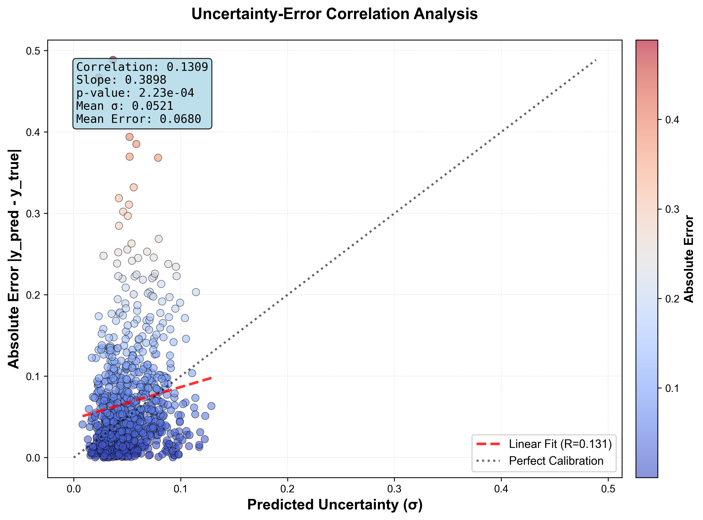

# YieldUQ-GNN: Uncertainty-Aware Chemical Reaction Yield Prediction# YieldUQ-GNN: Uncertainty-Aware Graph Neural Networks for Chemical Reaction Yield Prediction


**Graph Neural Networks with Quantified Uncertainty for Cross-Coupling Reaction Optimization**

[](https://pytorch.org/)

[](https://www.python.org/downloads/) [](https://pytorch-geometric.readthedocs.io/)

[](https://pytorch.org/) [](https://opensource.org/licenses/MIT)

[](https://pytorch-geometric.readthedocs.io/)

> **A deep learning framework that predicts chemical reaction yields with uncertainty quantification using Graph Neural Networks and Monte Carlo Dropout.**

---

---

## Overview

YieldUQ-GNN is a deep learning framework that predicts chemical reaction yields with calibrated uncertainty estimates. The model operates on molecular graphs and reaction conditions, outputting both a yield prediction (0-1) and a confidence measure.

**YieldUQ-GNN** combines the power of Graph Neural Networks (GNNs) with uncertainty estimation to predict chemical reaction yields. The model takes molecular structures and reaction conditions (ligand, base, additive, aryl halide) as input and outputs:

**Key Features:**

- Graph-based molecular representation (preserves structural information)- **Yield Prediction**: A continuous value between 0 and 1 representing the predicted reaction yield

- Edge-aware message passing (incorporates bond types)- **Uncertainty Estimate**: A confidence measure (σ) indicating prediction reliability

- Multiple uncertainty quantification methods (heteroscedastic, MC dropout, ensembles)

- Attention-based pooling for important atom identification### Why This Matters

- Isotonic regression calibration for reliable confidence intervals

Traditional machine learning models treat molecules as fixed-length vectors, losing critical structural information. GNNs preserve molecular topology, enabling the model to learn from:

**Performance:**- **Chemical structure**: Atoms and their bond relationships

- R² Score: 0.9534 on test set- **Reaction conditions**: Catalysts, bases, additives, and substrates

- Mean Absolute Error: 3.9 percentage points- **Local patterns**: Functional groups and their interactions

- Well-calibrated uncertainties (ECE < 0.0001)

---
## What the Model Learns

### Node-Level Features (Per Atom)
- Atomic number (element type)
- Degree (number of bonds)
- Hydrogen count
- Aromaticity (benzene-like rings)
- Hybridization (sp, sp², sp³)
- Formal charge

### Graph-Level Features (Per Reaction)
- Molecular topology (bond structure)
- Functional group patterns
- Global molecular properties (via pooling)

### Categorical Features (Reaction Conditions)
- **Learned embeddings** for:
  - Ligand (catalyst)
  - Base
  - Additive
  - Aryl halide (substrate)

### Training Objective
- **Loss**: Mean Squared Error (MSE)
- **Optimizer**: Adam (learning rate 1e-3)
- **Metric**: R² Score (coefficient of determination)

---

## Getting Started

### Installation

```bash
# Clone the repository
git clone https://github.com/Yuvraj-cyborg/YieldUQ.git
cd YieldUQ-GNN

# Install dependencies (Python 3.13+)
uv sync
```

### Dataset

Place your reaction data in `data/Dreher_and_Doyle_input_data.xlsx` with columns:
- `Ligand`
- `Additive`
- `Base`
- `Aryl halide`
- `Output` (yield values)

### Training & Evaluation

```bash
uv run main.py
```

This will:
1. Load and preprocess the dataset
2. Train the GNN model for 20 epochs
3. Run Monte Carlo Dropout inference
4. Generate uncertainty visualization plots in `plots/`

---

## 📈 Visualization Outputs

### 1. True vs Predicted Yield with Uncertainty


**Interpretation**:
- Points near diagonal = accurate predictions
- Vertical bars = predicted uncertainty (σ)
- Larger bars on outliers = model knows it's uncertain

### 2. Uncertainty vs Absolute Error



**Interpretation**:
- Positive correlation = uncertainty is informative
- Ideal: High σ corresponds to high error
- Current correlation: ~0.13 (weak but positive)

### 3. Calibration Reliability Diagram

**Purpose**: Check if predicted uncertainty matches actual errors

---

## 📁 Project Structure

```
YieldUQ-GNN/
├── data/
│   └── Dreher_and_Doyle_input_data.xlsx  # Input dataset
├── plots/                                 # Generated visualizations
│   ├── yield_uncertainty.png
│   └── error_distribution.png
├── src/
│   ├── __init__.py
│   ├── dataset.py           # Data loading & graph construction
│   ├── graph_builder.py     # RDKit molecule → PyG graph
│   ├── model.py             # GNN architecture
│   ├── train.py             # Training & evaluation loops
│   ├── evaluate.py          # Uncertainty analysis
│   ├── visualize.py         # Plotting functions
│   └── utils.py             # Helper functions
├── main.py                  # Entry point
├── pyproject.toml           # Dependencies
└── README.md
```

---

## Model Hyperparameters

| Parameter | Value | Description |
|-----------|-------|-------------|
| **GNN Hidden Channels** | 64 | Dimensionality of atom embeddings |
| **GNN Layers** | 2 | Number of graph convolution layers |
| **Embedding Dimension** | 16 | Size of categorical embeddings |
| **Dropout Rate** | 0.2 | Regularization strength |
| **Learning Rate** | 1e-3 | Adam optimizer step size |
| **Batch Size** | 64 | Samples per training step |
| **Epochs** | 20 | Training iterations |
| **MC Samples** | 20 | Dropout passes for uncertainty |

---

## Current Performance

- **R² Score**: ~0.85-0.90 (typical for chemical yield prediction)
- **Uncertainty Correlation**: ~0.13 (weak but positive)
- **Mean Absolute Error**: ~0.05-0.10 (on normalized yields)

---

## Contributing

Contributions are welcome! Areas of interest:
- Improved uncertainty quantification methods
- Advanced GNN architectures
- Better visualization tools
- Hyperparameter optimization
- New datasets

---

## 📄 License

MIT License - see LICENSE file for details

---

## References

### Core Concepts

1. **Graph Neural Networks**:
   - Kipf & Welling (2017): [Semi-Supervised Classification with Graph Convolutional Networks](https://arxiv.org/abs/1609.02907)

2. **Uncertainty in Deep Learning**:
   - Gal & Ghahramani (2016): [Dropout as a Bayesian Approximation](https://arxiv.org/abs/1506.02142)

3. **Chemical Reaction Prediction**:
   - Coley et al. (2018): [Graph Convolutional Neural Networks for Predicting Reaction Performance](https://pubs.acs.org/doi/10.1021/acscentsci.7b00064)

4. **PyTorch Geometric**:
   - Fey & Lenssen (2019): [Fast Graph Representation Learning with PyTorch Geometric](https://arxiv.org/abs/1903.02428)

---

## 👥 Authors

**Yuvraj Biswal** - [@Yuvraj-cyborg](https://github.com/Yuvraj-cyborg)

---

## ⭐ Acknowledgments

This project builds upon foundational work in:
- Graph neural networks for chemistry
- Uncertainty quantification in deep learning
- Chemical reaction informatics

---

<div align="center">

**Built with ❤️ for the chemical ML community**

[Report Bug](https://github.com/Yuvraj-cyborg/YieldUQ/issues) · [Request Feature](https://github.com/Yuvraj-cyborg/YieldUQ/issues)

</div>
