# YieldUQ-GNN: Uncertainty-Aware Graph Neural Networks for Chemical Reaction Yield Prediction

[](https://www.python.org/downloads/)
[](https://pytorch.org/)
[](https://pytorch-geometric.readthedocs.io/)
[](https://opensource.org/licenses/MIT)

> **A deep learning framework that predicts chemical reaction yields with uncertainty quantification using Graph Neural Networks and Monte Carlo Dropout.**

---

## 🎯 Overview

**YieldUQ-GNN** combines the power of Graph Neural Networks (GNNs) with uncertainty estimation to predict chemical reaction yields. The model takes molecular structures and reaction conditions (ligand, base, additive, aryl halide) as input and outputs:

- **Yield Prediction**: A continuous value between 0 and 1 representing the predicted reaction yield
- **Uncertainty Estimate**: A confidence measure (σ) indicating prediction reliability

### Why This Matters

Traditional machine learning models treat molecules as fixed-length vectors, losing critical structural information. GNNs preserve molecular topology, enabling the model to learn from:
- **Chemical structure**: Atoms and their bond relationships
- **Reaction conditions**: Catalysts, bases, additives, and substrates
- **Local patterns**: Functional groups and their interactions

---

## 🏗️ Architecture Overview

### High-Level Pipeline

```mermaid
graph LR
    A[Reaction Data] --> B[Data Processing]
    B --> C[Graph Construction]
    B --> D[Categorical Encoding]
    C --> E[GNN Layers]
    D --> F[Embedding Layers]
    E --> G[Global Pooling]
    G --> H[Concatenation]
    F --> H
    H --> I[MLP Head]
    I --> J[Yield Prediction]
    I --> K[MC Dropout]
    K --> L[Uncertainty σ]
    
    style A fill:#e1f5ff
    style J fill:#c3f0ca
    style L fill:#fff4c3
```



### Detailed Model Architecture


### Data Flow & Representation


---

## 🔬 Key Concepts

### 1. Graph Neural Networks (GNNs) vs Traditional Neural Networks

| Aspect | Traditional NN (MLP) | Graph Neural Network |
|--------|---------------------|---------------------|
| **Input** | Fixed-length vector | Variable-size graph |
| **Structure** | Ignores connectivity | Preserves topology |
| **Learning** | Global patterns only | Local + Global patterns |
| **Chemistry** | "Bag of atoms" | "Molecular structure" |
| **Message Passing** | ❌ No | ✅ Yes - atoms communicate with neighbors |

### 2. How GNNs Process Molecular Graphs

1. **Message Passing**: Each atom aggregates information from its bonded neighbors
2. **Feature Transformation**: Linear layers + activation functions update node representations
3. **Multi-hop Learning**: Stacking layers allows information to flow across larger neighborhoods
4. **Global Pooling**: Average all atom embeddings to create a reaction-level representation

### 3. Handling Multiple Molecules

- **Disconnected Subgraphs**: Multiple reactants (A.B) form a single graph with disconnected components
- **No Inter-Molecule Bonds**: Message passing occurs within each molecule independently
- **Joint Representation**: Global pooling merges all molecules into one vector
- **Condition Integration**: Learned embeddings for catalysts/bases capture interaction patterns

### 4. Uncertainty Quantification via MC Dropout

**Monte Carlo Dropout** estimates epistemic uncertainty (model confidence):

1. **Training**: Dropout randomly deactivates 20% of neurons for regularization
2. **Inference**: Keep dropout enabled and run T predictions (e.g., T=20)
3. **Statistics**: 
   - **Mean**: Central yield prediction
   - **Std (σ)**: Prediction uncertainty
4. **Interpretation**: High σ → model is uncertain → prediction less reliable

```mermaid
graph LR
    A[Test Sample] --> B[Forward Pass 1<br/>Dropout ON]
    A --> C[Forward Pass 2<br/>Dropout ON]
    A --> D[Forward Pass 3<br/>Dropout ON]
    A --> E[... T times]
    
    B --> F[Prediction 1]
    C --> G[Prediction 2]
    D --> H[Prediction 3]
    E --> I[Prediction T]
    
    F --> J[Compute Mean μ]
    G --> J
    H --> J
    I --> J
    
    F --> K[Compute Std σ]
    G --> K
    H --> K
    I --> K
    
    J --> L[Final Prediction: μ ± σ]
    K --> L
    
    style A fill:#e1f5ff
    style L fill:#c3f0ca
```



---

## 📊 What the Model Learns

### Node-Level Features (Per Atom)
- Atomic number (element type)
- Degree (number of bonds)
- Hydrogen count
- Aromaticity (benzene-like rings)
- Hybridization (sp, sp², sp³)
- Formal charge

### Graph-Level Features (Per Reaction)
- Molecular topology (bond structure)
- Functional group patterns
- Global molecular properties (via pooling)

### Categorical Features (Reaction Conditions)
- **Learned embeddings** for:
  - Ligand (catalyst)
  - Base
  - Additive
  - Aryl halide (substrate)

### Training Objective
- **Loss**: Mean Squared Error (MSE)
- **Optimizer**: Adam (learning rate 1e-3)
- **Metric**: R² Score (coefficient of determination)

---

## 🚀 Getting Started

### Installation

```bash
# Clone the repository
git clone https://github.com/Yuvraj-cyborg/YieldUQ.git
cd YieldUQ-GNN

# Install dependencies (Python 3.13+)
pip install -e .
```

### Dataset

Place your reaction data in `data/Dreher_and_Doyle_input_data.xlsx` with columns:
- `Ligand`
- `Additive`
- `Base`
- `Aryl halide`
- `Output` (yield values)

### Training & Evaluation

```bash
python main.py
```

This will:
1. Load and preprocess the dataset
2. Train the GNN model for 20 epochs
3. Run Monte Carlo Dropout inference
4. Generate uncertainty visualization plots in `plots/`

---

## 📈 Visualization Outputs

### 1. True vs Predicted Yield with Uncertainty


**Interpretation**:
- Points near diagonal = accurate predictions
- Vertical bars = predicted uncertainty (σ)
- Larger bars on outliers = model knows it's uncertain

### 2. Uncertainty vs Absolute Error


**Interpretation**:
- Positive correlation = uncertainty is informative
- Ideal: High σ corresponds to high error
- Current correlation: ~0.13 (weak but positive)

### 3. Calibration Reliability Diagram

**Purpose**: Check if predicted uncertainty matches actual errors

---

## 📁 Project Structure

```
YieldUQ-GNN/
├── data/
│   └── Dreher_and_Doyle_input_data.xlsx  # Input dataset
├── plots/                                 # Generated visualizations
│   ├── yield_uncertainty.png
│   └── error_distribution.png
├── src/
│   ├── __init__.py
│   ├── dataset.py           # Data loading & graph construction
│   ├── graph_builder.py     # RDKit molecule → PyG graph
│   ├── model.py             # GNN architecture
│   ├── train.py             # Training & evaluation loops
│   ├── evaluate.py          # Uncertainty analysis
│   ├── visualize.py         # Plotting functions
│   └── utils.py             # Helper functions
├── main.py                  # Entry point
├── pyproject.toml           # Dependencies
└── README.md
```

---

## 🔧 Model Hyperparameters

| Parameter | Value | Description |
|-----------|-------|-------------|
| **GNN Hidden Channels** | 64 | Dimensionality of atom embeddings |
| **GNN Layers** | 2 | Number of graph convolution layers |
| **Embedding Dimension** | 16 | Size of categorical embeddings |
| **Dropout Rate** | 0.2 | Regularization strength |
| **Learning Rate** | 1e-3 | Adam optimizer step size |
| **Batch Size** | 64 | Samples per training step |
| **Epochs** | 20 | Training iterations |
| **MC Samples** | 20 | Dropout passes for uncertainty |

---

## 🎯 Current Performance

- **R² Score**: ~0.85-0.90 (typical for chemical yield prediction)
- **Uncertainty Correlation**: ~0.13 (weak but positive)
- **Mean Absolute Error**: ~0.05-0.10 (on normalized yields)

---

## 🚧 Known Limitations & Future Work

### Current Weaknesses

1. **Weak Uncertainty Calibration**: MC Dropout provides some signal but can be improved
2. **No Edge Features**: Bond types (single/double/aromatic) not yet utilized
3. **Simple Pooling**: Mean pooling may miss complex interactions
4. **No Explicit Interactions**: Disconnected molecules don't exchange information directly

### Roadmap

- [ ] **Heteroscedastic Uncertainty**: Model predicts both mean and variance
- [ ] **Edge Features**: Switch to GINEConv/NNConv with bond type embeddings
- [ ] **Advanced Pooling**: Implement attention-based or Set2Set pooling
- [ ] **Calibration**: Add isotonic regression for calibrated confidence intervals
- [ ] **More MC Samples**: Increase to 50-100 for smoother uncertainty
- [ ] **Model Checkpointing**: Save trained models for reuse
- [ ] **Hyperparameter Tuning**: Grid search for optimal architecture
- [ ] **3D Conformers**: Incorporate 3D molecular geometry
- [ ] **Ensemble Methods**: Combine multiple models for better uncertainty

---

## 📚 Key Dependencies

- **PyTorch**: Deep learning framework
- **PyTorch Geometric**: Graph neural network library
- **RDKit**: Chemical informatics toolkit
- **Pandas**: Data manipulation
- **Matplotlib/Seaborn**: Visualization
- **Scikit-learn**: Metrics and utilities

---

## 🤝 Contributing

Contributions are welcome! Areas of interest:
- Improved uncertainty quantification methods
- Advanced GNN architectures
- Better visualization tools
- Hyperparameter optimization
- New datasets

---

## 📄 License

MIT License - see LICENSE file for details

---

## 📖 References

### Core Concepts

1. **Graph Neural Networks**:
   - Kipf & Welling (2017): [Semi-Supervised Classification with Graph Convolutional Networks](https://arxiv.org/abs/1609.02907)

2. **Uncertainty in Deep Learning**:
   - Gal & Ghahramani (2016): [Dropout as a Bayesian Approximation](https://arxiv.org/abs/1506.02142)

3. **Chemical Reaction Prediction**:
   - Coley et al. (2018): [Graph Convolutional Neural Networks for Predicting Reaction Performance](https://pubs.acs.org/doi/10.1021/acscentsci.7b00064)

4. **PyTorch Geometric**:
   - Fey & Lenssen (2019): [Fast Graph Representation Learning with PyTorch Geometric](https://arxiv.org/abs/1903.02428)

---

## 👥 Authors

**Yuvraj Biswal** - [@Yuvraj-cyborg](https://github.com/Yuvraj-cyborg)

---

## ⭐ Acknowledgments

This project builds upon foundational work in:
- Graph neural networks for chemistry
- Uncertainty quantification in deep learning
- Chemical reaction informatics

---

<div align="center">

**Built with ❤️ for the chemical ML community**

[Report Bug](https://github.com/Yuvraj-cyborg/YieldUQ/issues) · [Request Feature](https://github.com/Yuvraj-cyborg/YieldUQ/issues)

</div>
